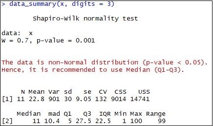
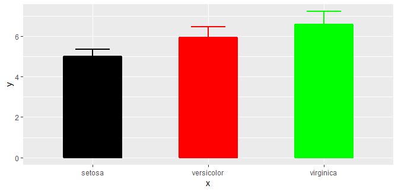

# R11

## Installing "R11" package in R

Get the development version from github:

    install.packages("devtools")
	devtools::install_github("PhDMeiwp/R11@master", force = TRUE)
	library(R11)

## Usage
	data_summary(x, digits = 3)
	
	ggbar_MeanSD(x, y, 
			fill.bar = NULL, width.bar = 0.5, 
			col.border = NULL, size.border = 1, 
			alpha = 1, 
			width.errorbar = 0.3, col.errorbar = NULL, size.errorbar = 1)

## Examples
	# library(R11)
    x<-c(1,3,4,6,8,11,13,15,40,50,100) 
    data_summary(x, digits = 3)
	
*then output as follows:*

 
	
	# library(R11)
	y = iris$Sepal.Length
	x = iris$Species
	ggbar_MeanSD(x, y)
	
*then output as follows:*
 
  